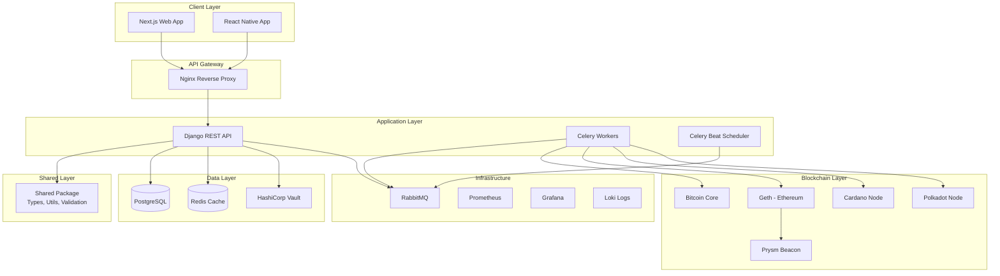
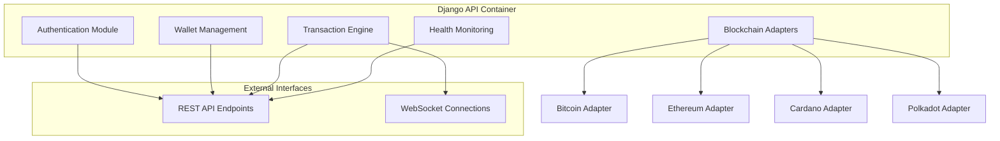

# Sound Pesa Platform Design Document

## Overview

Sound Pesa is a containerized monorepo cryptocurrency platform that enables secure peer-to-peer transactions across Bitcoin, Ethereum, Cardano, and Polkadot networks. The architecture follows microservices principles with Docker orchestration, implementing a clean separation between frontend applications, API services, blockchain infrastructure, and shared utilities.

The platform uses a hub-and-spoke model where the Django REST API serves as the central transaction coordinator, interfacing with multiple blockchain nodes while serving both web and mobile frontends. All services communicate through internal Docker networks with comprehensive monitoring and security layers.

## Architecture

### High-Level Architecture



### Container Architecture

The platform consists of the following containerized services:

**Application Containers:**
- `api`: Django REST API with blockchain integration
- `web`: Next.js frontend application
- `app`: React Native development server
- `celery-worker`: Background task processing
- `celery-beat`: Scheduled task coordination

**Data Services:**
- `postgres`: Primary database for user data and transactions
- `redis`: Caching layer and Celery message broker
- `vault`: Secrets and key management

**Blockchain Infrastructure:**
- `bitcoin-core`: Bitcoin network connectivity
- `geth`: Ethereum execution layer
- `prysm-beacon`: Ethereum consensus layer
- `cardano-node`: Cardano blockchain interface
- `polkadot`: Polkadot relay chain connection

**Supporting Services:**
- `nginx`: Reverse proxy and load balancer
- `rabbitmq`: Message queue with management interface
- `prometheus`: Metrics collection
- `grafana`: Monitoring dashboards
- `loki`: Centralized logging
- `promtail`: Log aggregation

## Components and Interfaces

### API Service Architecture



### Core API Endpoints

**Authentication & User Management:**
- `POST /api/auth/register` - User registration
- `POST /api/auth/login` - User authentication
- `POST /api/auth/logout` - Session termination
- `GET /api/user/profile` - User profile data

**Wallet Operations:**
- `GET /api/wallets` - List user wallets across chains
- `POST /api/wallets/create` - Generate new wallet addresses
- `GET /api/wallets/{chain}/balance` - Get balance for specific chain
- `GET /api/wallets/{chain}/history` - Transaction history

**Transaction Processing:**
- `POST /api/transactions/send` - Initiate cryptocurrency transfer
- `GET /api/transactions/{id}` - Transaction status and details
- `GET /api/transactions/pending` - List pending transactions
- `POST /api/transactions/estimate-fee` - Calculate transaction fees

**Blockchain Integration:**
- `GET /api/blockchain/{chain}/status` - Node synchronization status
- `GET /api/blockchain/{chain}/block-height` - Current block information

### Frontend Architecture

**Next.js Web Application:**
- Server-side rendering for SEO optimization
- TypeScript integration with shared types
- Responsive design with Tailwind CSS
- Real-time transaction updates via WebSocket
- Progressive Web App capabilities

**React Native Mobile Application:**
- Cross-platform iOS/Android support
- Biometric authentication integration
- Offline data caching with Redux Persist
- Push notification handling
- Deep linking for transaction sharing

### Shared Package Structure

```
packages/shared/
├── types/
│   ├── blockchain.ts      # Blockchain-specific types
│   ├── transaction.ts     # Transaction data structures
│   ├── user.ts           # User and authentication types
│   └── api.ts            # API request/response types
├── utils/
│   ├── validation.ts     # Input validation schemas
│   ├── crypto.ts         # Cryptographic utilities
│   ├── formatting.ts     # Data formatting helpers
│   └── constants.ts      # Platform-wide constants
├── blockchain/
│   ├── bitcoin.ts        # Bitcoin-specific utilities
│   ├── ethereum.ts       # Ethereum helpers
│   ├── cardano.ts        # Cardano integration
│   └── polkadot.ts       # Polkadot utilities
└── config/
    ├── networks.ts       # Blockchain network configurations
    └── environment.ts    # Environment-specific settings
```

## Data Models

### User Management

```typescript
interface User {
  id: string;
  email: string;
  username: string;
  created_at: Date;
  updated_at: Date;
  is_active: boolean;
  two_factor_enabled: boolean;
  kyc_status: 'pending' | 'approved' | 'rejected';
}

interface UserProfile {
  user_id: string;
  first_name: string;
  last_name: string;
  phone_number?: string;
  country: string;
  date_of_birth?: Date;
}
```

### Wallet System

```typescript
interface Wallet {
  id: string;
  user_id: string;
  blockchain: 'bitcoin' | 'ethereum' | 'cardano' | 'polkadot';
  address: string;
  encrypted_private_key: string;
  created_at: Date;
  is_active: boolean;
}

interface WalletBalance {
  wallet_id: string;
  balance: string; // Using string for precise decimal handling
  confirmed_balance: string;
  unconfirmed_balance: string;
  last_updated: Date;
}
```

### Transaction Processing

```typescript
interface Transaction {
  id: string;
  user_id: string;
  from_wallet_id: string;
  to_address: string;
  blockchain: string;
  amount: string;
  fee: string;
  status: 'pending' | 'confirmed' | 'failed' | 'cancelled';
  transaction_hash?: string;
  block_height?: number;
  confirmations: number;
  created_at: Date;
  confirmed_at?: Date;
}

interface TransactionEstimate {
  blockchain: string;
  amount: string;
  estimated_fee: string;
  estimated_confirmation_time: number; // minutes
  network_congestion: 'low' | 'medium' | 'high';
}
```

### Blockchain Node Status

```typescript
interface BlockchainStatus {
  blockchain: string;
  is_synced: boolean;
  current_block: number;
  highest_block: number;
  sync_percentage: number;
  peer_count: number;
  last_block_time: Date;
  network: 'mainnet' | 'testnet';
}
```

## Error Handling

### API Error Response Format

```typescript
interface APIError {
  error: {
    code: string;
    message: string;
    details?: Record<string, any>;
    timestamp: Date;
    request_id: string;
  };
}
```

### Error Categories

**Authentication Errors (4xx):**
- `AUTH_INVALID_CREDENTIALS`: Invalid login credentials
- `AUTH_TOKEN_EXPIRED`: JWT token has expired
- `AUTH_INSUFFICIENT_PERMISSIONS`: User lacks required permissions
- `AUTH_2FA_REQUIRED`: Two-factor authentication needed

**Validation Errors (4xx):**
- `VALIDATION_INVALID_ADDRESS`: Blockchain address format invalid
- `VALIDATION_INSUFFICIENT_BALANCE`: Wallet balance too low
- `VALIDATION_AMOUNT_TOO_SMALL`: Transaction amount below minimum
- `VALIDATION_INVALID_CHAIN`: Unsupported blockchain network

**Blockchain Errors (5xx):**
- `BLOCKCHAIN_NODE_UNAVAILABLE`: Blockchain node connection failed
- `BLOCKCHAIN_TRANSACTION_FAILED`: Transaction broadcast failed
- `BLOCKCHAIN_NETWORK_CONGESTION`: Network temporarily overloaded
- `BLOCKCHAIN_INVALID_TRANSACTION`: Transaction rejected by network

**System Errors (5xx):**
- `SYSTEM_DATABASE_ERROR`: Database operation failed
- `SYSTEM_CACHE_ERROR`: Redis cache unavailable
- `SYSTEM_QUEUE_ERROR`: Message queue processing failed

### Error Recovery Strategies

- **Retry Logic**: Exponential backoff for blockchain node communications
- **Circuit Breaker**: Temporary service isolation during high error rates
- **Graceful Degradation**: Cached data serving when services unavailable
- **Transaction Rollback**: Database transaction reversal on processing failures

## Testing Strategy

### Unit Testing
- **API Services**: Django test framework with pytest
- **Frontend Components**: Jest and React Testing Library
- **Shared Utilities**: TypeScript unit tests with Jest
- **Blockchain Adapters**: Mock blockchain responses for isolated testing

### Integration Testing
- **API Endpoints**: Full request/response cycle testing
- **Database Operations**: PostgreSQL transaction testing
- **Blockchain Integration**: Testnet transaction validation
- **Container Communication**: Docker network connectivity tests

### End-to-End Testing
- **User Workflows**: Cypress tests for complete transaction flows
- **Multi-Chain Operations**: Cross-blockchain transaction scenarios
- **Mobile Application**: Detox framework for React Native testing
- **Performance Testing**: Load testing with realistic transaction volumes

### Security Testing
- **Authentication**: JWT token validation and expiration
- **Authorization**: Role-based access control verification
- **Input Validation**: SQL injection and XSS prevention
- **Cryptographic Operations**: Private key security and transaction signing

### Monitoring and Observability

**Metrics Collection:**
- Transaction processing times and success rates
- Blockchain node synchronization status
- API endpoint response times and error rates
- Container resource utilization (CPU, memory, disk)
- Database query performance and connection pooling

**Alerting Rules:**
- Blockchain node disconnection or sync lag
- Transaction failure rate exceeding threshold
- API response time degradation
- Database connection pool exhaustion
- Container memory or disk space limits

**Log Aggregation:**
- Structured JSON logging across all services
- Transaction audit trails with correlation IDs
- Security event logging (authentication, authorization)
- Blockchain interaction logs with transaction hashes
- Error stack traces with contextual information

This design provides a robust, scalable foundation for the Sound Pesa multi-chain cryptocurrency platform while maintaining security, observability, and developer experience as core principles.