# Sound Pesa Platform Architecture

## Overview

Sound Pesa is a containerized monorepo cryptocurrency platform that enables secure peer-to-peer transactions across multiple blockchain networks. The architecture follows microservices principles with Docker orchestration, implementing clean separation between frontend applications, API services, blockchain infrastructure, and shared utilities.

## System Architecture

### High-Level Architecture Diagram

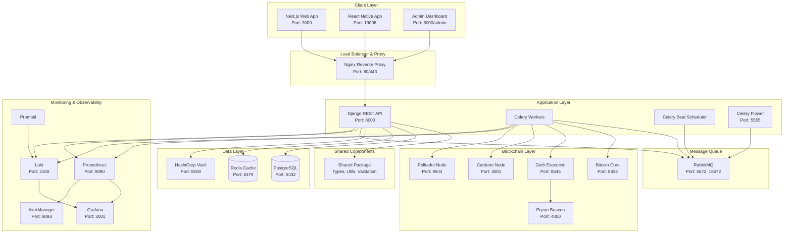

## Container Architecture

### Service Definitions

| Service | Image | Ports | Dependencies | Description |
|---------|-------|-------|--------------|-------------|
| **nginx** | nginx:alpine | 80, 443 | api, web | Reverse proxy and load balancer |
| **api** | sound-pesa/api | 8000 | postgres, redis, vault | Django REST API service |
| **web** | sound-pesa/web | 3000 | api | Next.js web application |
| **app** | sound-pesa/app | 19006 | api | React Native development server |
| **celery-worker** | sound-pesa/api | - | postgres, redis, rabbitmq | Background task processing |
| **celery-beat** | sound-pesa/api | - | postgres, redis, rabbitmq | Scheduled task coordination |
| **celery-flower** | sound-pesa/api | 5555 | rabbitmq | Celery monitoring interface |
| **postgres** | postgres:15 | 5432 | - | Primary database |
| **redis** | redis:7-alpine | 6379 | - | Cache and session store |
| **rabbitmq** | rabbitmq:3-management | 5672, 15672 | - | Message queue with management UI |
| **vault** | vault:1.15 | 8200 | - | Secrets and key management |
| **bitcoin-core** | bitcoin/bitcoin:25.0 | 8332 | - | Bitcoin network connectivity |
| **geth** | ethereum/client-go:v1.13 | 8545, 8546 | - | Ethereum execution layer |
| **prysm-beacon** | gcr.io/prysmaticlabs/prysm/beacon-chain:v4.1 | 4000 | geth | Ethereum consensus layer |
| **cardano-node** | inputoutput/cardano-node:8.7.3 | 3001 | - | Cardano blockchain interface |
| **polkadot** | parity/polkadot:v1.6 | 9944 | - | Polkadot relay chain connection |
| **prometheus** | prom/prometheus:v2.47 | 9090 | - | Metrics collection |
| **grafana** | grafana/grafana:10.2 | 3001 | prometheus | Monitoring dashboards |
| **loki** | grafana/loki:2.9 | 3100 | - | Centralized logging |
| **promtail** | grafana/promtail:2.9 | - | loki | Log aggregation |
| **alertmanager** | prom/alertmanager:v0.26 | 9093 | prometheus | Alert management |

### Network Architecture

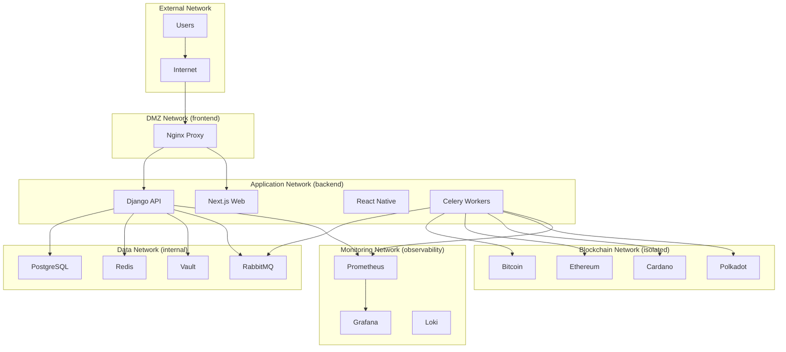

## Component Architecture

### API Service Architecture

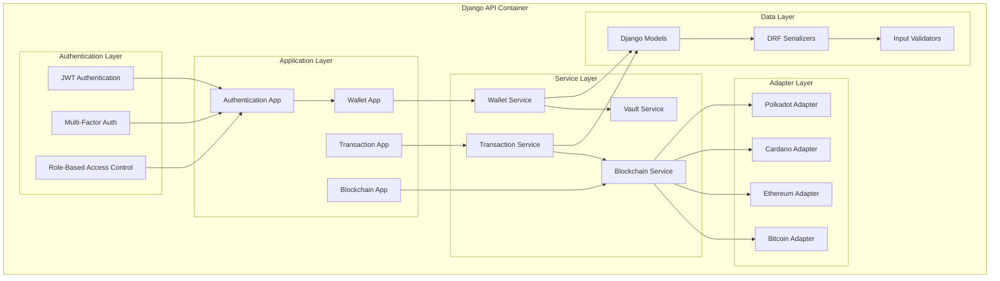

### Frontend Architecture

```mermaid
graph TB
    subgraph "Next.js Web Application"
        subgraph "Pages Layer"
            AUTH_PAGES[Authentication Pages]
            DASHBOARD_PAGES[Dashboard Pages]
            PROFILE_PAGES[Profile Pages]
        end
        
        subgraph "Component Layer"
            UI_COMPONENTS[UI Components]
            WALLET_COMPONENTS[Wallet Components]
            FORM_COMPONENTS[Form Components]
        end
        
        subgraph "State Management"
            CONTEXT[React Context]
            HOOKS[Custom Hooks]
            CACHE[SWR Cache]
        end
        
        subgraph "Service Layer"
            API_CLIENT[API Client]
            WS_CLIENT[WebSocket Client]
            PWA_SERVICE[PWA Service]
        end
    end
    
    subgraph "React Native Mobile App"
        subgraph "Screen Layer"
            AUTH_SCREENS[Auth Screens]
            WALLET_SCREENS[Wallet Screens]
            SEND_SCREENS[Send Screens]
        end
        
        subgraph "Component Layer"
            NATIVE_COMPONENTS[Native Components]
            SECURITY_COMPONENTS[Security Components]
            SCANNER_COMPONENTS[Scanner Components]
        end
        
        subgraph "State Management"
            REDUX[Redux Store]
            PERSIST[Redux Persist]
            MIDDLEWARE[Redux Middleware]
        end
        
        subgraph "Native Services"
            BIOMETRIC[Biometric Auth]
            SECURE_STORAGE[Secure Storage]
            PUSH_NOTIFICATIONS[Push Notifications]
        end
    end
    
    AUTH_PAGES --> UI_COMPONENTS
    DASHBOARD_PAGES --> WALLET_COMPONENTS
    PROFILE_PAGES --> FORM_COMPONENTS
    
    UI_COMPONENTS --> CONTEXT
    WALLET_COMPONENTS --> HOOKS
    FORM_COMPONENTS --> CACHE
    
    CONTEXT --> API_CLIENT
    HOOKS --> WS_CLIENT
    CACHE --> PWA_SERVICE
    
    AUTH_SCREENS --> NATIVE_COMPONENTS
    WALLET_SCREENS --> SECURITY_COMPONENTS
    SEND_SCREENS --> SCANNER_COMPONENTS
    
    NATIVE_COMPONENTS --> REDUX
    SECURITY_COMPONENTS --> PERSIST
    SCANNER_COMPONENTS --> MIDDLEWARE
    
    REDUX --> BIOMETRIC
    PERSIST --> SECURE_STORAGE
    MIDDLEWARE --> PUSH_NOTIFICATIONS
```

## Data Architecture

### Database Schema

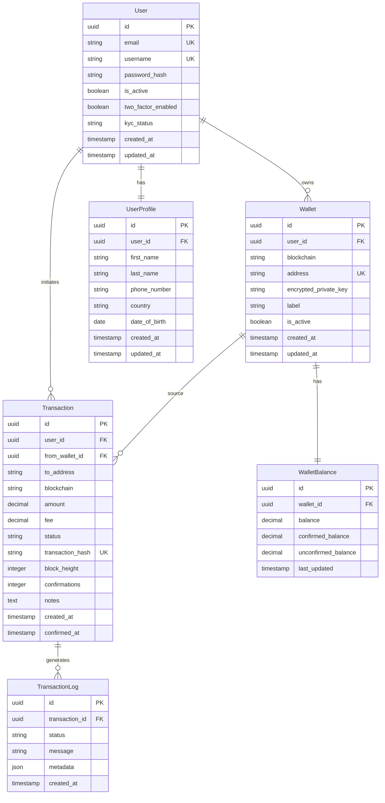

### Caching Strategy

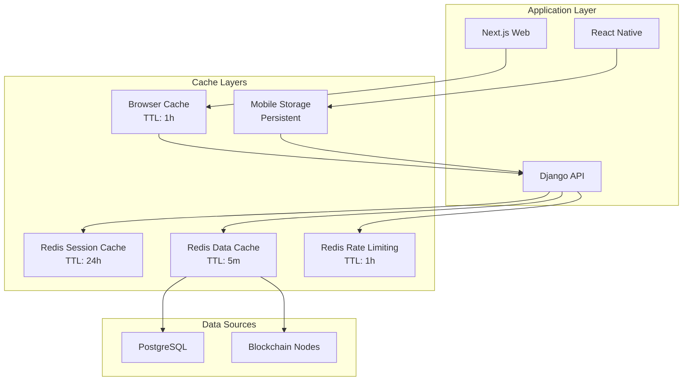

## Security Architecture

### Security Layers

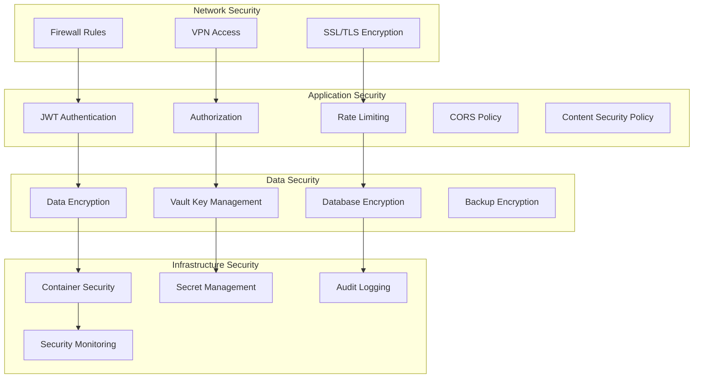

### Key Management

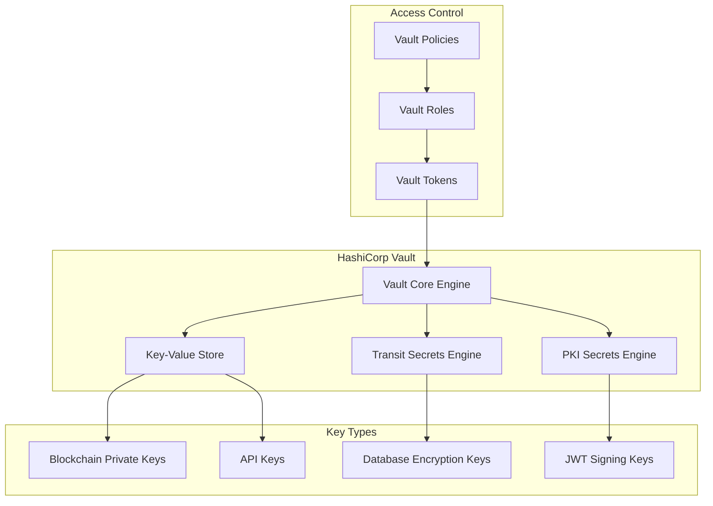

## Monitoring & Observability

### Metrics Collection

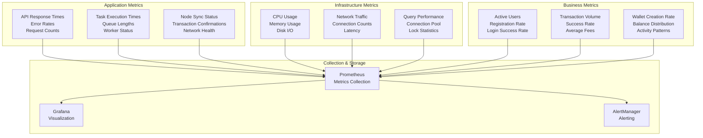

### Logging Architecture

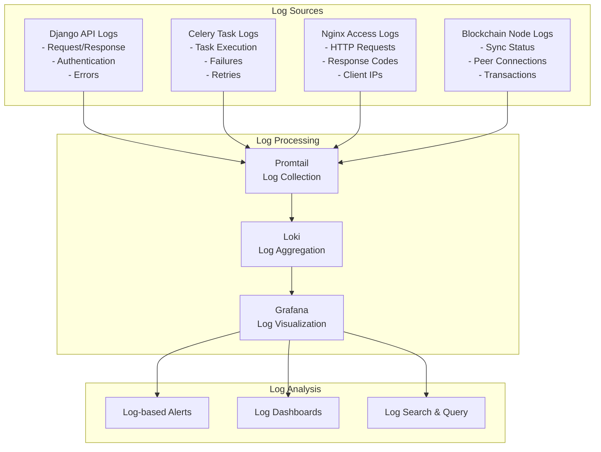

## Deployment Architecture

### Environment Configurations

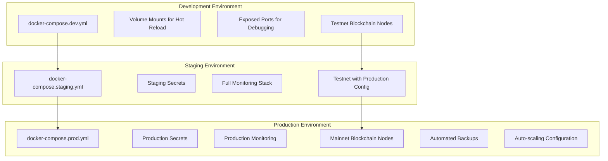

### Scaling Strategy

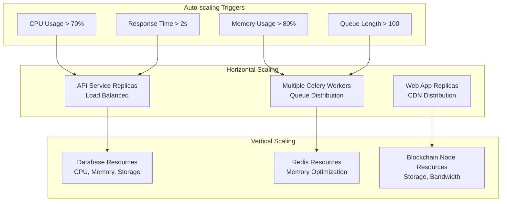

## Performance Considerations

### Database Optimization

- **Connection Pooling**: pgbouncer for PostgreSQL connections
- **Read Replicas**: Separate read/write database instances
- **Indexing Strategy**: Optimized indexes for frequent queries
- **Query Optimization**: Use of select_related and prefetch_related
- **Partitioning**: Table partitioning for large transaction tables

### Caching Strategy

- **Application Cache**: Redis for frequently accessed data
- **Database Query Cache**: ORM-level query caching
- **API Response Cache**: HTTP response caching with appropriate TTL
- **Static Asset Cache**: CDN caching for frontend assets
- **Blockchain Data Cache**: Cached blockchain queries with smart invalidation

### Network Optimization

- **CDN Integration**: Global content delivery network
- **Compression**: Gzip compression for API responses
- **HTTP/2**: Modern HTTP protocol support
- **Connection Pooling**: Persistent connections to external services
- **Load Balancing**: Intelligent request distribution

## Disaster Recovery

### Backup Strategy

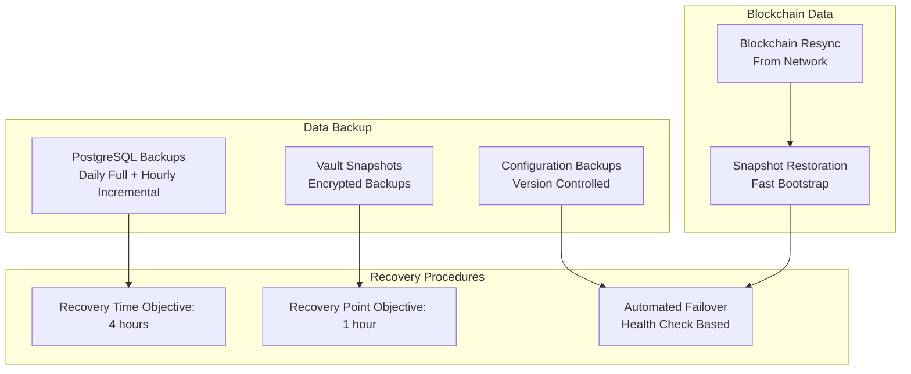

### High Availability

- **Multi-AZ Deployment**: Services distributed across availability zones
- **Database Clustering**: PostgreSQL cluster with automatic failover
- **Load Balancer Health Checks**: Automatic traffic routing to healthy instances
- **Circuit Breaker Pattern**: Graceful degradation during service failures
- **Backup Services**: Standby services ready for immediate activation

This architecture provides a robust, scalable, and secure foundation for the Sound Pesa multi-chain cryptocurrency platform while maintaining high availability and performance standards.